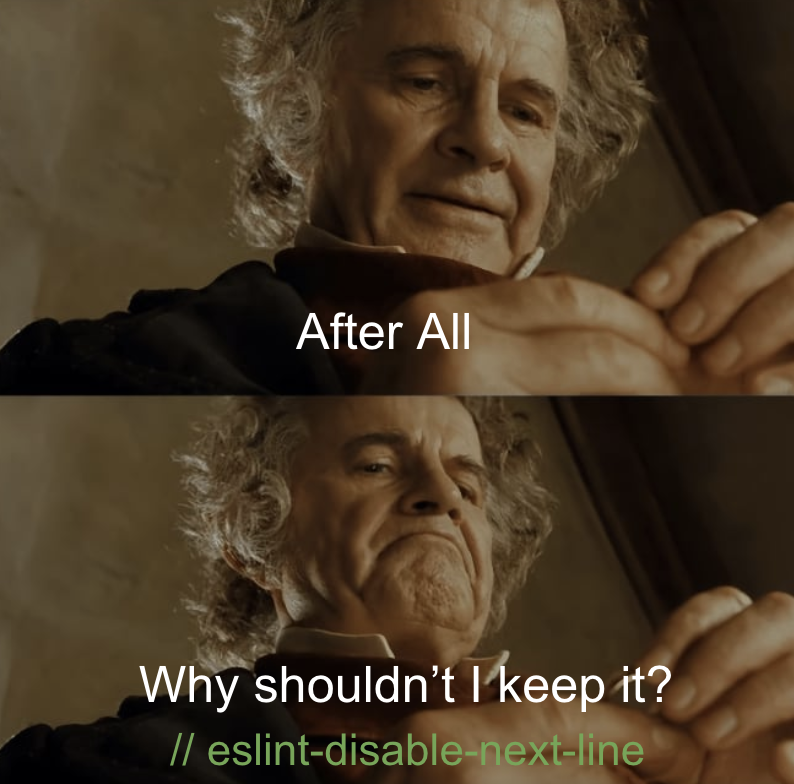

   
 

# Ugh, Coding Standards...

The concept of coding standards might initially appear dull, especially for those new to the world of computer science. Questions about how many spaces to use for indentation or where to place curly braces might seem trivial. However, as I delve deeper into the field, I've come to appreciate the significance of coding standards.

## Why Do Coding Standards Matter?

Imagine working on a large project with a team of developers. Coding standards serve as a common language that everyone can understand. They provide consistency and clarity, preventing the confusion that can arise when each team member uses a different coding style. It's like having a rulebook that ensures everyone is on the same page.

Additionally, coding standards contribute to the learning process. They help newcomers grasp a programming language's best practices and conventions more effectively. It's similar to learning a spoken language—by following established rules, you become more fluent.

## ESLint and IntelliJ: My Experience as a Beginner

During my first week using ESLint with IntelliJ, I encountered those little red lines that occasionally appeared in my code. Initially, they seemed like annoying errors, almost like my computer was constantly pointing out my mistakes. However, I soon realized that these red lines were valuable guidance, akin to a friendly tutor saying, "Hey, you might want to improve this part of your code."

Reaching that green checkmark felt like a small victory. It signaled that I was aligning with the coding standards, akin to the satisfaction of pedaling a bicycle without falling—a small accomplishment but significant nonetheless.

I've also been exploring AI-powered coding tools to expedite my code-writing process. Remarkably, these tools adhere to the ESLint rules as well. It's like having an intelligent coding companion who consistently follows best practices.

In summary, I've learned that coding standards are the secret sauce of proficient programming. Though they may initially appear meticulous, they profoundly impact how we write and comprehend code. For beginners like me in the computer science realm, understanding and embracing coding standards is crucial. They are our allies in the fascinating world of coding!