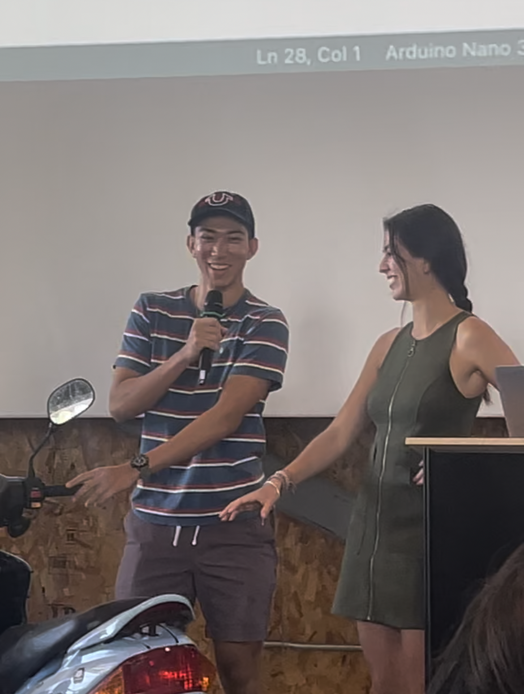

  

A simple-to-use anti-theft device that alerts you when someone messes with your moped!

## MopedSafe Recognized at 2024 Honolulu Tech Week Hackathon

More than 3,000 thefts were reported in 2023—including motorcycles, motor scooters, and mopeds—according to the Honolulu Police Department’s crime dashboard. To address this problem, PACE Leaders Andrea Murillo Martinez, a junior in electrical engineering, and Kai Garcia, a senior in computer science, developed MopedSafe, a hardware technology solution aimed at combating moped theft.

### Project Presentation

Their project used the latest technology to detect moped movements. The system sends real-time alerts to a user’s smartphone via Bluetooth if suspicious activity is detected.

MopedSafe took home both the Best Hardware-Related Project Award and the People’s Choice Award, with a combined prize of $2,000. Martinez and Garcia are exploring ways to bring MopedSafe to the market and collaborate with a mobile telecommunications company.

Martinez and Garcia credit their experience to PACE and their entrepreneur in residence, Jeff Hui.

> “It was great to see the aspects of PACE, like the challenges startups face and how to analyze the market. It helped us think about our own value proposition,” said Martinez.

*Content adapted from the [University of Hawaiʻi News article](https://www.hawaii.edu/news/2024/12/17/pace-leaders-2024-honolulu-tech-week-hackathon/).*

You can find the project on my [GitHub](https://github.com/KaiGarcia/moped-anti-theft).

